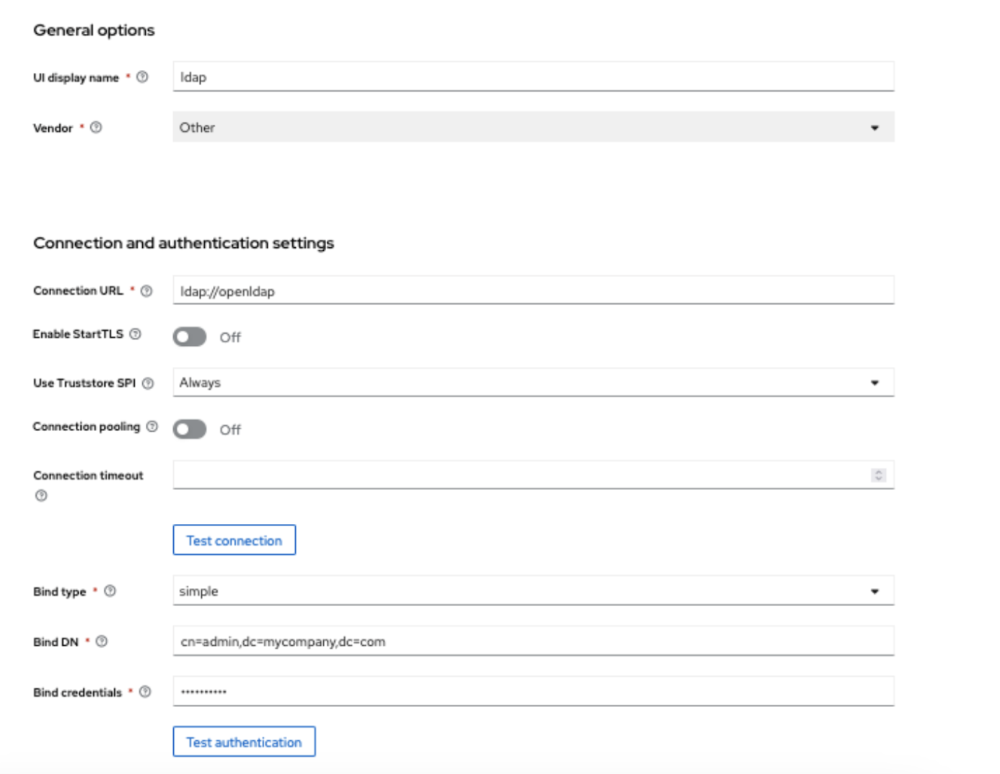
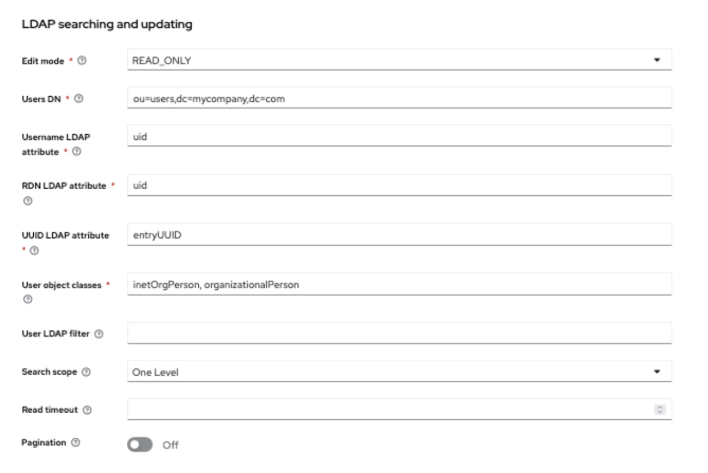
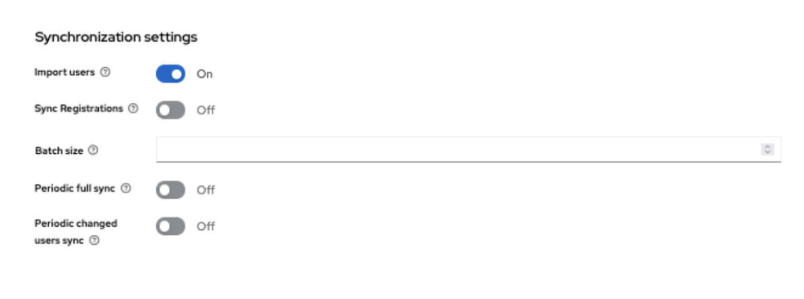
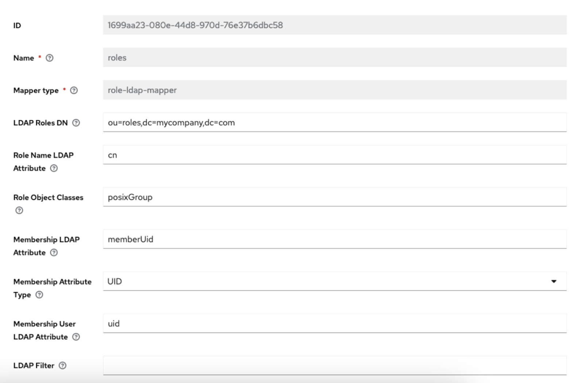
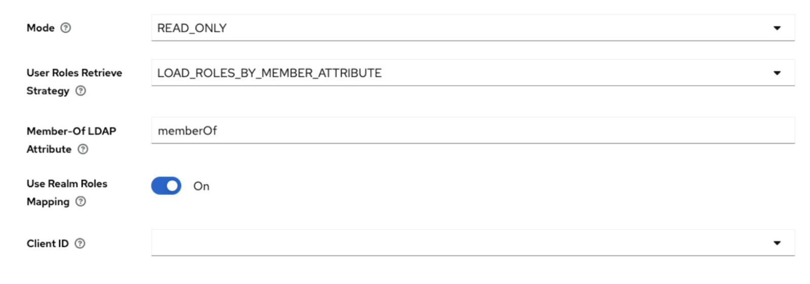

Keycloak Open Policy Integration Demo
----

This project deploys **Keycloak**, **LDAP**, and **Open Policy Agent (OPA)** to demonstrate how to integrate these components for identity management and policy enforcement.

[Slides](keycloak-devday-2024-flexible-authz-for-keycloak-with-openpolicyagent.pdf)

# Build

```
mvn clean package -DskipTests
```

# Run

## Run with HTTP

Start the docker compose setup with Keycloak, Open Policy Agent, Mail server and LDAP.

```
docker compose -f dev/docker-compose.yml up
```

## Run with HTTPS

This example uses https://id.kubecon.test:8443/auth as the Keycloak auth server URL.

To use the example with https just add a mapping for `id.kubecon.test` to your `/etc/hosts` file
and regenerate the certificates via the [mkcert](https://github.com/FiloSottile/mkcert) tool first.

Then start the `dev/docker-compose-https.yml` docker compose file.

´´´
(cd dev/config/certs && mkcert -install && mkcert -cert-file kubecon.pem -key-file kubecon-key.pem "*.kubecon.test")

docker compose -f dev/docker-compose-https.yml up
´´´

# Demo

Once up, you can access Keycloak via http://localhost:8080/auth and login with `admin/admin`.

The demo contains a realm called `opademo` that is configured via `dev/config/realms/opademo.yaml`
through [keycloak-config-cli](https://github.com/adorsys/keycloak-config-cli).

# Integrating LDAP in Keycloak and Syncing Users

To integrate LDAP in Keycloak and synchronize users, follow these steps:
1. **Go to User Federation**:
   - In the **Realm** left menu, click on **User Federation**.
   - Click on **Add LDAP provider** to configure the LDAP connection.
2. **Configure LDAP Settings**:




3. **Add Mapper for Roles**:



4. **Example LDIF File**:
   - An example of how to structure your LDAP data for import can be found in the `users.ldif` file. This file defines user entries that can be imported into your LDAP server. 


## Adding Clients in Keycloak

To create clients in Keycloak, follow these steps:

1. **Access the Keycloak Administration Console**:
   - Open your web browser and navigate to your Keycloak admin console (e.g., `http://localhost:8080/auth/admin`).
   - Log in with your admin credentials.

2. **Select Your Realm**:
   - From the top left dropdown menu, select the realm where you want to create the client.

3. **Navigate to Clients**:
   - In the left menu, click on **Clients**.

4. **Create a New Client**:
   - Click on the **Create** button to add a new client.

5. **Configure Client Settings**:
   - Fill in the following fields:
     - **Client ID**: Enter a unique identifier for the client (e.g., `my-app`).
     - **Client Protocol**: Choose the protocol for the client, typically `openid-connect`.
     - **Root URL**: Provide the root URL for your client application (optional).
     - **Valid Redirect URIs**: Specify the URIs that are valid for redirecting after authentication.

6. **Save the Client**:
   - Click the **Save** button to create the client.


## Realm configuration

The realm with the clients, roles, groups and users are defined in the `dev/config/realms/opademo.yaml` 
config file. 


To apply the changed realm configuration to the running Keycloak instance, just execute the following command:

`docker restart dev-keycloak-provisioning-1`.

# Custom Event Listener
A Custom Event Listener has been included to capture all events in the "opademo" realm.

You can check this by going to `Realm settings` -> `Events` 

A new class has been added that listens for all events, when a resource request or a new log in is triggered. This class queries OPA and checks the established policies.